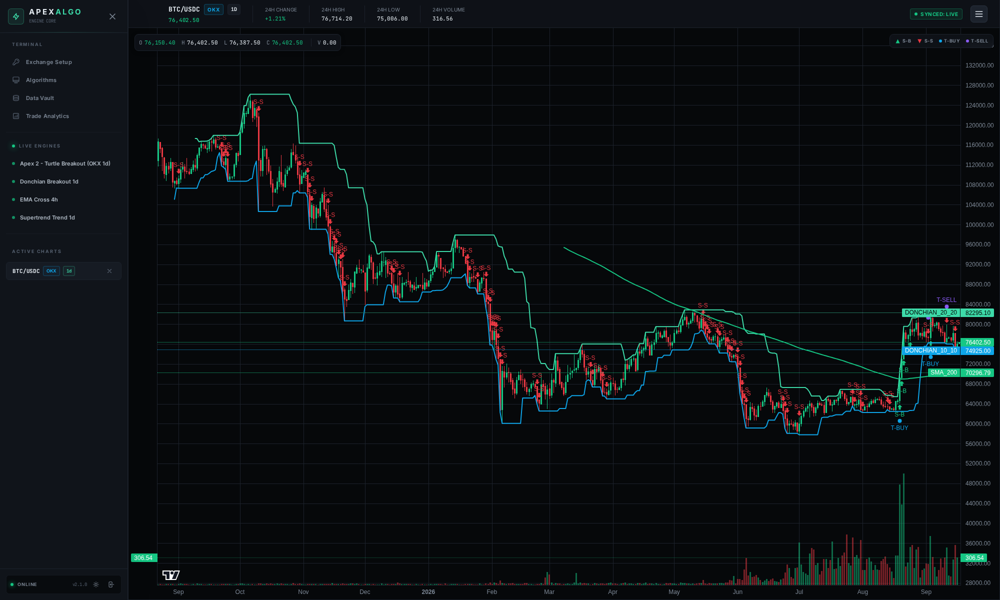
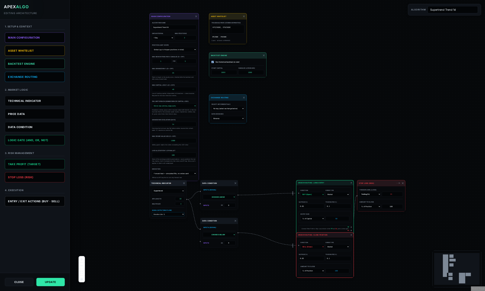
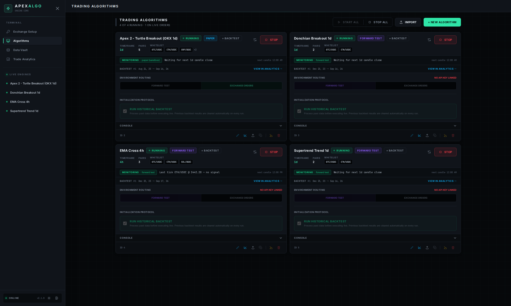
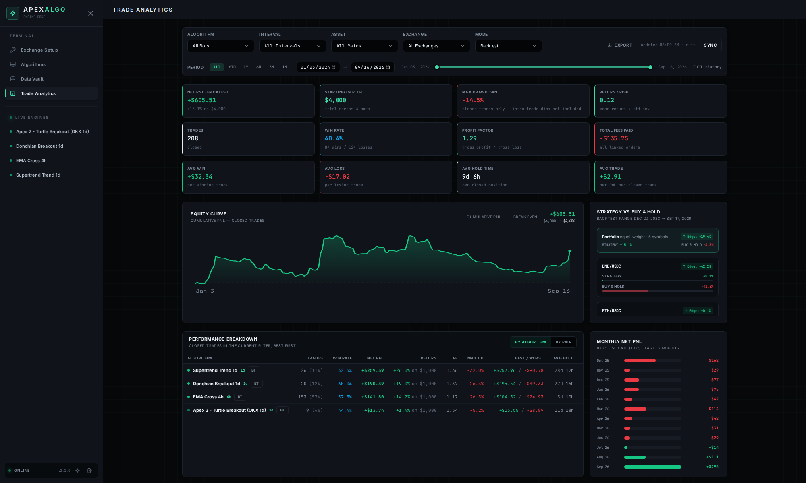
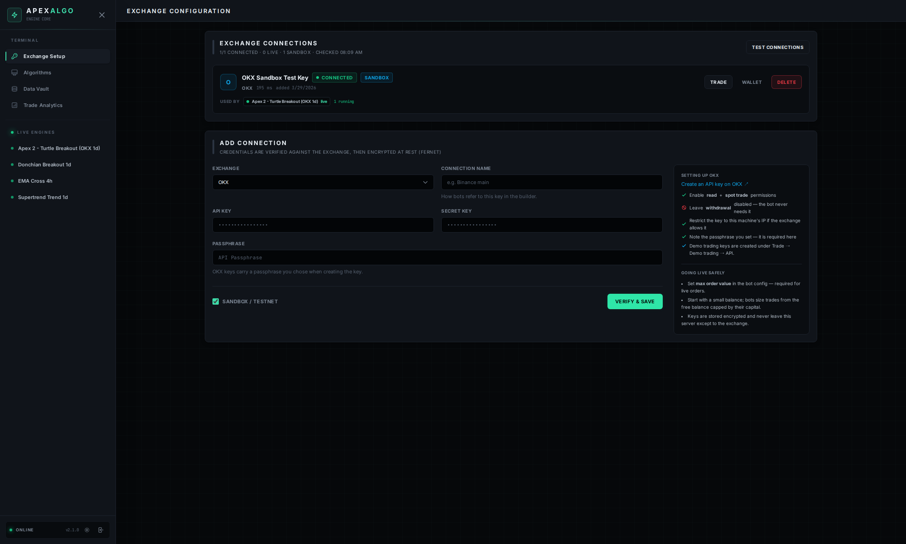
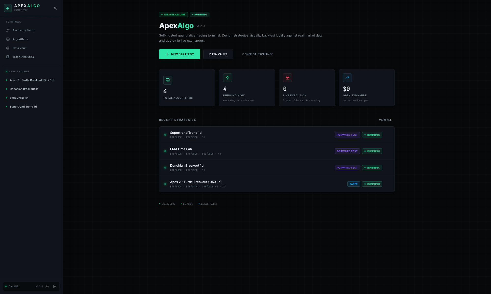
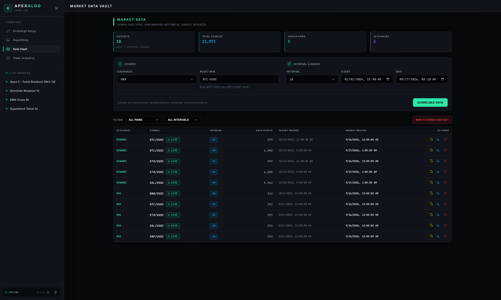

# ApexAlgo

> **Advanced Visual Quantitative Trading Framework**


[](LICENSE)

ApexAlgo is a full-stack algorithmic trading platform for building, backtesting, and executing systematic trading strategies — without writing code. A node-based visual strategy builder connects directly to a high-performance async execution engine with multi-exchange market data, encrypted exchange key management, and real-time per-bot console output.

> **Open source, beta quality.** ApexAlgo is free software under the [AGPL-3.0](LICENSE) — issues and pull requests are welcome, see [CONTRIBUTING.md](CONTRIBUTING.md). New here? Start with **[BETA.md](BETA.md)** — step-by-step setup, your first bot in 5 minutes, and mandatory safety rules for live trading. Want an AI to design a strategy for you? Paste **[STRATEGY_CONTEXT.md](STRATEGY_CONTEXT.md)** into any AI assistant and import the resulting `.apex.json`. Ready-made strategies live in [`examples/`](examples/).

---

## Demo

One command to your first bot — 24 s, with sound.

https://github.com/user-attachments/assets/25d03926-1e88-4749-88d4-b97b14ff9c2b


<sub>Player not showing? [Download the MP4](docs/screenshots/demo.mp4?raw=true).</sub>

## Screenshots

**Chart Engine** — TradingView-grade candles with per-bot overlays: indicator lines, historical/live trade markers and the engine's raw buy/sell "thoughts", all toggled per algorithm.



**Strategy Builder** — the node graph that *is* the strategy: indicators → conditions → logic gates → order routing, with risk blocks (take profit / stop loss) attached to the entry.



**Algorithms** — every bot card shows the engine's live phase (fetching → backtesting → monitoring), the backtest variant and data range with a jump to Analytics, why the engine stopped it, and one-click restart / start-all / stop-all.



**Trade Analytics** — net PnL, win rate, profit factor, drawdown, equity curve, strategy vs buy & hold, breakdown per algorithm or pair, monthly PnL — all scoped by the period slider and filters.



**Exchange Setup** — verified, encrypted connections with latency, linked bots, wallet valuation in USD and a per-exchange setup guide.



<details>
<summary>More: Home and Data Vault</summary>





</details>

---

## Features

### Strategy Builder
- **Visual Node Editor** — drag-and-drop canvas with 51+ technical indicators, logic gates, conditions, and action nodes
- **No-Code Strategy Design** — connect indicator, condition, and logic nodes to build complex entry/exit rules
- **Exchange Routing Node** — select an API key (exchange auto-derived from the key) or manually pick a data exchange when running without a key
- **ReactFlow Graph Serialization** — strategies are compiled to JSON and evaluated per candle

### Execution Engine
- **Three Execution Modes** — forward test (simulated), paper trading (sandbox API), and live exchange execution
- **Async Event-Driven Architecture** — FastAPI backend with concurrent bot management via asyncio
- **Multi-Exchange Market Data** — universal REST polling via CCXT; each `(exchange, symbol, timeframe)` gets its own independent polling stream
- **CCXT Integration** — exchange-agnostic order execution with market precision handling
- **Perpetual swaps with leverage, long and short** — a bot trades spot or perpetuals (1–10×, isolated or cross margin), **linear** (stablecoin-settled, `BTC/USDT:USDT`) or **inverse** (coin-margined, `BTC/USD:BTC`); the kind is a property of the symbol, not of the key. On perpetuals the strategy can open shorts (`SHORT` / `COVER` action blocks) with mirrored stop-loss/take-profit rules; backtest, forward test and live share the same margin/liquidation model, and spot bots are untouched
- **One cash currency per bot** — every pair of a whitelist must be quoted (spot) or settled (swap) in the same currency (validator-enforced), so a bot can run in USDT, USDC, EUR, USD or BTC. Money is always shown in that currency and never summed across currencies

### Multi-Exchange Support
- **13 Exchanges out of the box** — OKX, Binance, Bitvavo, Coinbase, Crypto.com, Kraken, KuCoin, Bybit, Gate, Bitget, MEXC, HTX, BingX; perpetual swaps on nine of them (linear and inverse contracts, BingX linear only; Binance COIN-M runs through ccxt's `binancecoinm` class)
- **Isolated data streams** — bots on different exchanges poll independently and store candles separately; no cross-exchange data mixing
- **Exchange Registry** — centralized `exchange_registry.py` handles per-exchange config (OKX EU hostname, passphrase exchanges, sandbox modes)
- **Automatic migration** — existing databases are upgraded non-destructively on startup; all historical data is preserved

### Bot Management
- **Live Bot Console** — each bot card has an expandable scrollable console showing real-time engine events (backfill progress, BUY/SELL fills, errors, max drawdown triggers). Persisted in a `bot_logs` table — survives backend restarts
- **Export to File** — save any bot's strategy and settings to a portable `.apex.json` file
- **Import from File** — restore a bot from a previously exported file; name collisions are resolved automatically
- **Duplicate Bot** — clone a bot's configuration without copying its trade history or signal cache
- **Cache Wipe** — clears chart signals, resets the bot's log buffer, and clears the frontend console in one operation

### Performance
- **SQLite WAL Mode** — write-ahead logging enables concurrent reads during writes; bots no longer block each other on database access
- **Incremental Backfill Commits** — candle data is committed to the database after each exchange batch, not all at once; eliminates startup race conditions when multiple bots start simultaneously
- **Indicator Fingerprinting** — bots sharing the same indicator configuration reuse computed results via MD5-based fingerprint keys, avoiding redundant pandas_ta calls in the live processing loop
- **Evaluator Memoization** — `resolve_node()` caches resolved Series per evaluation cycle so diamond-shaped node graphs don't recompute shared indicator nodes
- **Drawdown Caching** — drawdown is tracked per `(bot, mode_group)` with separate `backtest`, `forward` (forward test) and `live` (paper + live) caches, so a simulated forward loss never counts against the real-money curve. Lazy-initialized from DB, updated incrementally on every closed leg
- **Backfill Lock** — `_backfilling_bots` set prevents live processing from creating duplicate signals while a bot is mid-backfill
- **Signal Deduplication** — unique constraint on `(bot_name, symbol, timestamp)` with `INSERT OR IGNORE` prevents duplicate signals on bot restart
- **Incremental Signal Polling** — ChartEngine uses `since_id` to fetch only new signals after initial load, reducing per-poll payload from thousands of rows to near-zero
- **Composite Indexes** — dedicated indexes on orders (cooldown checks), candles (lookup by exchange/symbol/timeframe/timestamp), positions (bot/status/mode/symbol), and signals (bot/symbol/timestamp + unique constraint) for hot-path query performance
- **Batched Live Processing** — all open positions, exchange keys, and cooldown counts pre-loaded in 1–2 queries before the bot loop (not per-bot). All signals collected and committed in a single batch after all bots process. One `db.commit()` per candle close event
- **Market Info TTL Cache** — ticker data cached for 10 seconds per symbol, reducing exchange API calls during UI polling
- **Bounded Event Bus** — `asyncio.Queue(maxsize=1000)` with drop-oldest overflow prevents unbounded memory growth from slow subscribers
- **Numpy-Backed Backtest Loop** — indicator and signal arrays are pre-extracted from DataFrames before the per-candle iteration
- **Vectorized Streak Detection** — `increasing_for` / `decreasing_for` conditions use `rolling().sum()` instead of Python loops
- **Batched Signal Inserts** — signals are committed in 500-row chunks to reduce SQLite write lock duration
- **Background Bot Deletion** — deleting a bot returns instantly; heavy cleanup of orders, positions, signals, and logs runs asynchronously after the response
- **Gzip Compression** — nginx compresses JSON, HTML, JS, CSS, and XML responses (threshold: 512 bytes, level 6)
- **Static Asset Caching** — nginx serves hashed Vite assets with `Cache-Control: max-age=31536000, immutable`; index.html is never cached
- **Container Resource Limits** — docker-compose sets CPU/memory caps per service to prevent resource starvation

### Backtesting
- **Shared Capital Pool** — `backtest_capital` is a single pool in the bot's cash currency, shared across all whitelist pairs (`engine/capital.py`, `CapitalPools`). When BTC uses 140 of it, only the remainder is available for ETH/SOL/XRP. An entry locks margin plus the entry fee; on close the proceeds (spot) or margin + PnL − exit fee (derivatives) return to the pool
- **Dynamic Trade Sizing** — `percentage` sizing is a percentage of the **free cash** left in the pool (not of mark-to-market equity), so sizes compound across pairs and shrink as capital is locked. A `fixed` amount is a cash amount in the bot's currency. `max_order_value` (a quote-currency notional) caps every entry in the backtest, forward test and live alike and is therefore part of the strategy fingerprint. Trading halts when the pool reaches zero
- **Honest returns** — `profit_pct` is the return on the capital a trade had locked (margin + entry fee), in the backtest, forward test, live tick and manual close alike; liquidation is modelled in the backtest and forward test and detected live
- **Capital Depletion Guard** — before opening any position, the engine verifies sufficient capital. No phantom-money trades
- **Post-Backtest Drawdown Gate** — backtest always runs to completion; max drawdown is evaluated over all closed positions afterward. If the threshold is exceeded, the bot is stopped and not allowed to go live
- **Vectorized Historical Evaluation** — fast backtest over configurable lookback periods with numpy-backed arrays
- **Stable Backfill Detection** — waits for 5 consecutive stable candle counts (10 seconds) before proceeding, preventing premature backtest starts when exchange data is still loading
- **Backfill Retry Logic** — transient API errors during backfill are retried up to 3 times with exponential backoff; per-thread exchange instances prevent shared rate-limit interference
- **Exchange Timeframe Validation** — unsupported timeframes are detected before backfill/polling; a clear warning is shown when a timeframe isn't available on the selected exchange
- **Adaptive Lookback** — if the exchange has fewer candles than requested (e.g. 5,000 available vs. 50,000 requested), the backtest runs on whatever is available (minimum 20 candles required)
- **Fee-Adjusted P&L** — entry/exit fees and slippage applied to all profit calculations; computed fee amounts are stored on each Order record so the analytics page can report accurate total fees paid
- **Automatic Position Closure** — open positions at backtest end are closed at last price with proper P&L

### Risk Management
- **Tiered Take Profit / Stop Loss** — multiple TP/SL levels with percentage or fixed close amounts
- **ATR & Trailing Stops** — dynamic stop-loss adjustment based on price action
- **Trade Cooldown** — configurable max entries per N candles, counted per symbol and in candles (the window starts at the N-th most recent stored candle, in the backtest and live alike)
- **Position Limits** — per-pair or global max concurrent positions
- **Max Drawdown Guard** — evaluated after full backtest to gate live entry; during live trading, checked mark-to-market on every candle (forward-test and real-money curves are tracked separately). Default action `close_all` closes every position and stops the bot; opt-in `block_entries` pauses new entries until drawdown recovers below half the limit — or the bot has been flat for a configurable cooldown (default 7 days), after which the peak resets — while exits keep running (simulated identically in the backtest). A separate **Max Capital Loss** guard (loss of starting capital) is the hard stop and follows the same action: close everything immediately, or wind down (no new entries, exits finish, then stop)
- **Max Order Value Guard** — caps every entry to a configurable quote-currency notional (USD on `BTC/USD:BTC`, EUR on `BTC/EUR`); mandatory for live bots, applied in the backtest and forward test too

### Order Safety
- **Order Fill Validation** — verifies exchange order status after every CCXT call
- **Unique Order Identification** — UUID-suffixed local order IDs prevent duplicate entries
- **Exchange Instance Caching** — single CCXT connection per bot cycle for performance
- **Structured Audit Logging** — order responses logged with id, status, filled amount, and fees

### Security
- **Fernet Encryption** — exchange API credentials encrypted at rest
- **Timing-Safe Authentication** — `X-API-Key` header for scripts, HttpOnly session cookie for the UI, both HMAC-compared
- **Local TLS** — self-signed or mkcert-generated trusted certificates
- **Environment Isolation** — secrets auto-generated during setup, never committed

### Analytics
- **Equity Curve** — inline SVG cumulative P&L chart over time (no external chart library)
- **Buy & Hold Comparison** — per-symbol strategy return vs. passive buy-and-hold; strategy % is `total_pnl / backtest_capital * 100` using the same capital base as B&H for fair comparison; reference price anchored to the true first entry across all positions (open and closed); live prices come from the bot's own data exchange
- **8-Metric Stats Strip** — Net P&L, Win Rate, Profit Factor, Max Drawdown (percentage of peak equity using backtest_capital), Avg Hold Time, Total Fees, Return/Risk ratio
- **Per-currency money** — every amount is printed in the currency it is denominated in (`1,234.50 USDT`, `€1,234.50`, `0.0213 BTC`) and a currency filter scopes the view; with several currencies (or several modes) in view the money tiles switch to per-currency chips instead of summing. Open positions, the ledger and the execution log carry a Side column (long/short) and label orders `BUY / SELL / SHORT / COVER`; a short is force-closed with "Buy to cover"
- **Avg Hold Time** — computed from entry order timestamps as fallback for backtests where position `created_at` reflects wall-clock run time rather than the candle entry time
- **Exchange Filter** — filter all analytics sections by exchange, bot, symbol, or execution mode
- **Real-Time Charts** — TradingView lightweight-charts with indicator overlays on correct axis scales
- **Position & Order Tracking** — detailed P&L with explicit +/- signs, fee tracking, and trade history
- **Signal Recording** — every entry/exit signal stored with indicator snapshot values
- **CSV Export** — download trade history for external analysis

---

## Quick Start (Docker)

> Requires only [Docker Desktop](https://docs.docker.com/get-docker/). No Python, Node, or manual setup.

```bash
git clone https://github.com/Stenvro/ApexAlgo.git
cd ApexAlgo
docker compose up -d
```

First start takes ~2 minutes (builds images + compiles frontend). Subsequent starts are instant unless you need a full rebuild (see [Development Workflow](#development-workflow)).

| Service | URL |
| :--- | :--- |
| Web UI (frontend + API proxy) | `https://localhost:5173` |
| Backend API (direct, optional) | `https://localhost:8000` |
| API Docs (Swagger) | disabled by default — start backend with `ENABLE_DOCS=1` |

> Accept the self-signed certificate warning in your browser on first visit — only once, on port 5173. The UI proxies all API calls through the same origin, so the backend certificate never needs to be trusted separately.
> Ports bind to `127.0.0.1` by default (local machine only). For LAN access see below.

### Managing ApexAlgo

| Command | Description |
| :--- | :--- |
| `docker compose up -d` | Start (detached) |
| `docker compose down` | Stop |
| `docker compose logs -f` | View all logs |
| `docker compose logs -f backend` | Backend logs only |
| `docker compose logs -f frontend` | Frontend logs only |
| `docker compose build && docker compose up -d` | Full rebuild (after pulling new code or changing Dockerfiles / dependencies) |
| `docker compose restart backend` | Apply backend code changes (~3–5 sec) |

---

## Development Workflow

Source code is bind-mounted into the running containers so you can iterate without rebuilding the Docker images:

| Path | Mounted to | Effect |
| :--- | :--- | :--- |
| `./backend/` | `/app/backend/` | Restart container to apply changes |
| `./frontend/src/` | `/app/frontend/src/` | Requires a frontend rebuild trigger (see below) |

### Backend changes

After saving a backend file, restart the container:

```bash
docker compose restart backend
```

Changes take effect in ~3–5 seconds. Hot-reload (`--reload`) is intentionally disabled to avoid unnecessary restarts from bind-mounted volume events.

### Frontend changes

After saving any file under `frontend/src/`, trigger a Vite rebuild:

```bash
rm -f data/.frontend-env-hash && docker restart apexalgo-frontend-1
```

The rebuild takes ~10–15 seconds. nginx automatically serves the new bundle.

### Full image rebuild

Required when changing `package.json`, `requirements.txt`, Dockerfiles, or entrypoint scripts:

```bash
docker compose build && docker compose up -d
```

### Tests and lint

The backend test suite (244 tests) runs against a throw-away SQLite file (your `data/` database is never touched) and covers the exit-rule table, a full live tick against a mocked exchange, swaps and shorts, contract economics (`test_contracts.py`), a **parity suite** (`test_parity_modes.py`: the same candles through backtest, forward test and a live mock, long/short, 1×/5×), **property tests** with hypothesis (`test_properties.py`: PnL sign, liquidation monotone in leverage, sizing never exceeds the pool), the routers, and **golden backtests**: every example strategy (plus a synthetic long/short swap fixture) is run on deterministic synthetic candles and its order stream is compared with `tests/golden/*.json`, so an engine change can never silently alter a strategy's trades.

```bash
pip install -r requirements-dev.txt
python -m pytest -q tests                 # ~75 s
ruff check backend tests scripts
cd frontend && npm run lint && npm run build
```

If a golden snapshot changes on purpose, regenerate it with `UPDATE_GOLDEN=1 python -m pytest -q tests/test_golden_backtest.py` and review the diff. To reproduce the example results on real exchange data (`STRATEGY_CONTEXT.md` §4.9):

```bash
python scripts/verify_examples.py          # all examples, as shipped
python scripts/verify_examples.py --only Supertrend --one-per-pair
```

The same checks run in GitHub Actions on every push and pull request.

### Custom LAN Access

By default both ports bind to `127.0.0.1` (local machine only). To reach the UI from other devices on your network, start with:

```bash
BIND_ADDR=0.0.0.0 docker compose up -d
```

Then browse to `https://YOUR-LAN-IP:5173` and accept the certificate warning. All API traffic flows through the same origin (the built-in proxy), so no additional configuration is needed. Never expose these ports to the public internet.

`VITE_API_BASE_URL` in `data/.env` is now optional: leave it empty (or unset) to use the same-origin proxy. Only set it if the frontend must call a backend on a *different* host, and expect one extra certificate acceptance on that origin.

### Data Persistence

All data lives in the `data/` folder on your host (bind-mounted into both containers):

```
data/
├── ApexAlgoDB.sqlite3    ← database
├── .env                  ← secrets + config
└── cert/
    ├── cert.pem          ← SSL certificate
    └── key.pem           ← SSL key
```

This is the same `data/` folder used by the manual install scripts — both methods are interchangeable. Stopping containers never deletes data. To fully reset, delete `data/` and restart.

---

## Manual Installation (without Docker)

Setup scripts in `install/` run ApexAlgo directly on the host using `screen` sessions.

### Requirements

| Dependency | Version | Notes |
| :--- | :--- | :--- |
| Python | 3.11+ | Auto-installed if missing |
| Node.js | 18+ | Auto-installed if missing |
| mkcert | latest | Auto-installed if missing |
| screen | any | Auto-installed if missing |

### Setup

```bash
git clone https://github.com/Stenvro/ApexAlgo.git
cd ApexAlgo
chmod +x install/*.sh
./install/Setup.sh
./install/Start_ApexAlgo.sh
```

Services run in detached `screen` sessions:

```bash
screen -r apex_backend    # attach to backend
screen -r apex_frontend   # attach to frontend
```

- **Detach** (keep running): `Ctrl+A` then `D`
- **Stop process**: `Ctrl+C`

### Switching Between Docker and Screen Sessions

Both methods share the same `data/` directory (database, certs, `.env`). Use the switch script to move between them:

```bash
./install/Switch_Mode.sh
```

The script auto-detects which mode is currently running and switches to the other. It handles:
- SQLite WAL checkpoint before stopping (prevents data corruption)
- Cleanup of Docker artifacts (stale symlinks, build cache, cert ownership)
- Cleanup of bare-metal symlinks when switching back to Docker
- Health check after starting Docker

If nothing is running, it prompts which mode to start.

### Environment Variables

Both setup methods (Docker and manual) auto-generate a `.env` file with secure keys on first run. The only value you may need to edit:

```env
VITE_API_BASE_URL=https://<your-ip>:8000
```

In Docker this is optional: an empty value means the frontend uses its own origin (the built-in API proxy). Manual (non-Docker) installs set it to the backend's address.

| Variable | Description | Auto-generated |
| :--- | :--- | :--- |
| `MASTER_API_KEY` | Backend authentication key for all API requests | Yes |
| `DATABASE_URL` | SQLAlchemy database connection string | Yes |
| `ENCRYPTION_KEY` | Fernet key used to encrypt exchange API credentials at rest | Yes |
| `VITE_API_BASE_URL` | Backend base URL for the frontend (empty = same-origin proxy) | Yes — optional in Docker |
| `CORS_ORIGINS` | Comma-separated list of allowed browser origins | Yes |
| `BIND_ADDR` | Host interface for published ports (default `127.0.0.1`; set `0.0.0.0` for LAN) | No — set when needed |
| `ENABLE_DOCS` | Set `1` to enable Swagger UI at `/docs` | No |

The frontend never embeds the API key. On first visit, enter the `MASTER_API_KEY` from `data/.env` in the login screen; the backend sets an `HttpOnly` session cookie (invalidated by a backend restart). Scripts and `curl` can still authenticate with the `X-API-Key` header.

---

## Architecture

```
ApexAlgo/
├── backend/
│   ├── core/
│   │   ├── database.py            # SQLAlchemy engine, WAL mode, session, idempotent migrations
│   │   ├── exchange_registry.py   # CCXT exchange factory for all supported exchanges
│   │   ├── bot_log_buffer.py      # Thin wrapper: push/get/clear bot logs in DB
│   │   ├── encryption.py          # Fernet credential encryption/decryption
│   │   ├── events.py              # Async event bus (CANDLE_CLOSED, BOT_STATE_CHANGED)
│   │   └── security.py            # API key authentication
│   ├── engine/
│   │   ├── bot_manager.py         # Engine front door: state, locks, CANDLE_CLOSED dispatch to the modules below
│   │   ├── backtest.py            # Chronological multi-pair simulation against one capital pool (pyramiding, MTM drawdown)
│   │   ├── live_cycle.py          # One live candle: entries, exits, signal batch, close-all
│   │   ├── startup.py             # Bot start: data wait/backfill, backtest, drawdown gate, reconciliation, go-live
│   │   ├── exits.py               # SL/TP/trailing/ATR/multi-tier exit rule table, one direction-parameterised body for longs and shorts
│   │   ├── contracts.py           # ContractSpec: spot / linear / inverse economics (notional, margin, PnL, liquidation, fees) in the cash currency
│   │   ├── capital.py             # CapitalPools: per-currency cash/locked/start pool (one currency per bot)
│   │   ├── pnl.py                 # Side-aware seam: direction, price_pnl, liquidation_price, locked_capital, order sides
│   │   ├── risk.py                # Drawdown / capital-loss tracking per (bot, backtest|forward|live group), unrealized PnL
│   │   ├── sizing.py              # Trade sizing, max_order_value cap, forward pool, config fingerprints
│   │   ├── broker.py              # ccxt plumbing: order reconciliation, cancel, min-notional, wallet checks
│   │   ├── candle_poller.py       # Universal multi-exchange REST polling with incremental backfill
│   │   ├── evaluator.py           # Node graph resolver using pandas_ta (memoized per evaluation cycle)
│   │   ├── indicator_registry.py  # Single source of truth for builder indicators (served at /api/indicators)
│   │   └── settings_validator.py  # Bot settings integrity checks
│   ├── models/
│   │   ├── bots.py                # BotConfig ORM
│   │   ├── bot_logs.py            # BotLog ORM — per-bot engine event log (persisted)
│   │   ├── positions.py           # Position ORM
│   │   ├── orders.py              # Order ORM
│   │   ├── signals.py             # Signal ORM
│   │   ├── candles.py             # Candle ORM (exchange-isolated)
│   │   └── exchange_keys.py       # ExchangeKey ORM
│   ├── routers/                   # API route handlers (bots, trades, data, keys)
│   └── main.py                    # App init, CORS, lifespan, migrations
├── frontend/
│   └── src/
│       ├── api/                   # Axios client (same-origin by default), error humanizer
│       ├── theme.js               # Light/dark theme state + token access
│       ├── utils/money.js         # fmtMoney(value, ccy), per-currency sums, cash currency / contract kind of symbols and rows
│       ├── utils/orders.js        # Side-aware order helpers (isShortOpen, isCover, orderAction, modeTag)
│       ├── examples/              # One-click loader; imports the strategies from the root examples/
│       └── components/
│           ├── Builder/           # Visual strategy editor (BotBuilder, CustomNodes, indicatorConfig)
│           ├── ui/                # Design-system primitives (Button, Toast, Modal, DataTable, …)
│           ├── ChartEngine.jsx    # TradingView charts, live ticker candle, signal overlays
│           ├── BotManagerUI.jsx   # Bot cards: start/stop, console, export/import/duplicate
│           ├── BotConsole.jsx     # Per-bot live log console (polling, auto-scroll, level colors)
│           ├── DataManager.jsx    # Historical data download and management (multi-exchange)
│           ├── TradeManager.jsx   # Quant analytics: equity curve, buy & hold, drawdown
│           ├── Home.jsx           # Dashboard landing (stats, recent strategies)
│           ├── ApiKeyGate.jsx     # Login screen (master key entry)
│           └── Settings.jsx       # Exchange key management (multi-exchange)
├── docker/
│   ├── backend.Dockerfile         # Python 3.11 + FastAPI + uvicorn (non-root)
│   ├── frontend.Dockerfile        # nginx + Node.js (builds frontend at startup)
│   ├── backend-entrypoint.sh      # Auto-generates .env + SSL certs, drops privileges
│   ├── frontend-entrypoint.sh     # Waits for .env, builds frontend, starts nginx
│   └── nginx.conf                 # SPA fallback + same-origin /api proxy + CSP + gzip
├── install/
│   ├── Setup.sh                   # Full setup (Python, Node, venv, deps, certs, .env)
│   ├── Start_ApexAlgo.sh          # Start backend + frontend in screen sessions
│   └── Switch_Mode.sh             # Switch between Docker and screen sessions
├── examples/                      # Verified importable strategies (.apex.json) — results in STRATEGY_CONTEXT.md §4.9
├── scripts/
│   └── verify_examples.py         # Re-runs the examples on real exchange candles in a temp DB (reproduces §4.9)
├── tests/                         # pytest suite: exit rules, live tick with exchange mock, swaps/shorts, contracts, parity, hypothesis properties, routers, golden backtests
│   └── golden/                    # Pinned order streams of the example strategies (+ a synthetic swap long/short fixture) on synthetic candles
├── .github/workflows/ci.yml       # pytest + ruff + npm lint/build on push and PR
├── docker-compose.yml             # Two services; ports on 127.0.0.1 by default (BIND_ADDR opt-in)
├── data/                          # Database, .env, SSL certs (gitignored)
├── requirements.txt
├── requirements-dev.txt           # pytest, ruff, httpx, hypothesis (tests + lint)
├── BETA.md                        # Beta tester guide (setup, safety rules, troubleshooting)
└── STRATEGY_CONTEXT.md            # AI context: builder reference + .apex.json import schema
```

---

## Data Flow

```
Strategy Builder (ReactFlow) ──serialize──> Bot Settings JSON
                                                │
                                          POST /api/bots/
                                                │
                                        Settings Validator
                                                │
                                           Save to DB
                                                │
                                     Bot Start ──> Backfill (historical backtest)
                                                │
                             CandlePoller (per exchange/symbol/timeframe)
                                  └── fetch_ohlcv polling ──> CANDLE_CLOSED event
                                                │
                                     NodeEvaluator resolves indicator → condition → logic
                                                │
                                     BotManager processes entries/exits
                                          │                  │
                                  bot_log_buffer          Exchange API
                                  (DB-persisted)       (CCXT paper/live)
                                          │
                          ┌───────────────┼──────────────────┐
                    Forward Test      Paper (Sandbox)      Live Exchange
                   (local simulation) (exchange sandbox)  (exchange production)
                                                │
                                     Position + Order + Signal ──> DB
                                                │
                            ┌───────────────────┴───────────────────┐
                     ChartEngine                              TradeManager
                  (TradingView signals)            (equity curve, buy & hold, stats)
                                                │
                                         BotManagerUI
                                    (live console via /logs polling)
```

---

## Bot Log Console

Each bot card in the Bot Manager has an expandable console panel. It streams the bot's engine output in real time by polling `GET /api/bots/{name}/logs?since={seq}` every 2 seconds while the panel is open — zero overhead when closed.

Logs are written to the `bot_logs` SQLite table by the engine (`backend/engine/`) at key execution points:

| Event | Level |
| :--- | :--- |
| Bot starting (symbol, timeframe, mode, lookback) | INFO |
| Waiting for candle data / data ready / data stalled | INFO / WARN |
| Backfill progress (every 100 candles) | INFO |
| Backfill complete (candle count + trade count) | INFO |
| Exchange limit reached (fewer candles than requested) | INFO |
| Running backtest on N candles | INFO |
| BUY filled / rejected / failed | INFO / WARN / ERROR |
| SELL filled / failed | INFO / ERROR |
| Max drawdown auto-stop | WARN |
| API key not found, falling back to forward_test | WARN |
| General strategy execution error | ERROR |

Log entries persist across backend restarts. Wiping the cache also clears the log buffer for that bot.

---

## Bot Export / Import / Duplicate

### Export
Click **Export** on any bot card to download a `.apex.json` file containing the bot's name, strategy graph, settings, and sandbox flag. Trade history and signals are not included.

```json
{
  "apex_version": "1.0",
  "exported_at": "2026-03-31T14:07:33Z",
  "bot": {
    "name": "My Strategy",
    "is_sandbox": true,
    "strategy": "<ReactFlow graph JSON>",
    "settings": { "timeframe": "1h", "symbols": ["BTC/USDT"] }
  }
}
```

### Import
Click **Import Bot** in the page header and select a `.apex.json` file. If the bot name already exists, `(imported)` is appended automatically. Bots imported without visual layout data (e.g. programmatically created) have their node graph automatically reconstructed in the editor.

### Duplicate
Click **Duplicate** on any stopped bot card to create a clone with `(copy)` appended to the name. The duplicate starts inactive with no trade history.

---

## Supported Exchanges

| Exchange | Passphrase | Spot sandbox | Perpetual swaps | Contract kinds | Notes |
| :--- | :--- | :--- | :--- | :--- | :--- |
| OKX | Yes | Yes | up to 10× (sandbox) | linear, inverse | EU hostname (eea.okx.com); net (one-way) position mode |
| Binance | No | Yes | up to 10× (sandbox) | linear, inverse | USDⓈ-M and COIN-M futures (COIN-M via ccxt `binancecoinm`), one-way position mode |
| Bitvavo | No | No | — | — | EU exchange |
| Coinbase | No | No | — | — | |
| Crypto.com | No | Yes | — | — | UAT environment |
| Kraken | No | No | up to 5× (demo) | linear, inverse | Kraken Futures uses its own keys (futures.kraken.com / demo-futures.kraken.com) |
| KuCoin | Yes | No | up to 10× | linear, inverse | KuCoin Futures uses its own keys (Futures → API management) |
| Bybit | No | Yes | up to 10× (testnet) | linear, inverse | Unified trading account, one-way position mode |
| Gate | No | Yes | up to 10× (testnet) | linear, inverse | |
| Bitget | Yes | Yes | up to 10× (demo) | linear, inverse | USDT-M futures, one-way position mode |
| MEXC | No | No | — | — | Futures API is closed to the public |
| HTX | No | No | up to 10× | linear, inverse | |
| BingX | No | Yes | up to 10× (demo) | linear | USDT-margined perpetuals, one-way position mode |

Adding another CCXT-compatible exchange is one `ExchangeSpec` entry in `backend/core/exchange_registry.py`; the key form, the data manager and the builder read the list from `GET /api/keys/exchanges`. `GET /api/data/symbols/{exchange}?market_type=swap` returns the tradeable symbols plus a `markets` map with `{kind, base, quote, settle, contract_size, cash_currency}` per symbol.

### Cash currency

Every bot keeps its books in exactly one **cash currency**: the quote of a spot pair (`BTC/EUR` → EUR) or the settle currency of a perpetual (`BTC/USDT:USDT` → USDT, `BTC/USD:BTC` → BTC). All pairs of a whitelist must share it (the validator rejects `BTC/USDT` + `ETH/BTC`), `backtest_capital` is read in it, and positions, orders, the backtest summary and the bot summary all carry `cash_currency` so the UI can print `1,234.50 USDT`, `€1,234.50` or `0.0213 BTC` — amounts are never summed across currencies. Orders additionally record `fee_currency` / `fee_cash` (what the exchange actually charged; `fee` is always converted to the cash currency), and `GET /api/trades/stats` groups its money fields in `by_currency` (the top-level fields carry the single-currency case; with several currencies in view they are `null`). Wallet valuation on the key page stays a display-only USD estimate (`valuation_currency: "USD"`).

### Perpetual swaps

An API key is bound to one market: save a second key with **Market: Perpetual swaps** for derivatives (the same exchange login, with futures/derivatives trade permission; Kraken and KuCoin issue separate futures keys). A bot on a swap key trades the `BASE/QUOTE:SETTLE` symbols with the leverage and margin mode set in the builder's Exchange Routing block (1–10×, isolated by default). Two contract kinds exist, decided per symbol (the whitelist shows a `linear` / `inverse` chip):

- **Linear** (`BTC/USDT:USDT`): settled in the quote stablecoin; `amount` is a base amount, PnL = `±(exit − entry) × amount` — the same arithmetic as spot.
- **Inverse** (`BTC/USD:BTC`, coin-margined): margin and PnL are in the base coin; `amount` is a number of contracts worth `contract_size` USD each, PnL = `±contracts × contract_size × (1/entry − 1/exit)`. Positions store `contract_kind` / `contract_size` so a later contract-size change on the exchange never rewrites history.

The engine confirms leverage and margin mode on the exchange before the first order and refuses to start when that fails; on start-up, open swap positions are reconciled against `fetch_positions` instead of the wallet, and a position the exchange no longer holds is booked as a liquidation rather than managed blind. A reconciliation that cannot be performed stops a real-money bot (a sandbox bot only warns).

Economics are identical across backtest, forward test and live: an entry locks `notional / leverage` plus the entry fee on the notional, PnL is on the full notional, `profit_pct` is measured on that locked capital. The liquidation level is `entry × (1 − (1 − 0.5%) / leverage)` for a linear long, `entry × (1 + (1 − 0.5%) / leverage)` for a linear short (a 1× long has none, a 1× short liquidates at +99.5%), and `entry × lev / (lev + 1 − 0.5%)` / `entry × lev / (lev − 1 + 0.5%)` on inverse contracts. Stop-losses and take-profits are evaluated first; only when nothing fills — or the fill would lie beyond the liquidation price — is the layer liquidated for its margin plus the entry fee already paid, without exit fee (`liquidation` in the exit list, `liquidations` in the backtest summary). The backtest and the forward test apply this rule on every candle; live, a liquidation is booked when the candle range reaches the level or when a rejected reduce-only close is followed by an empty `fetch_positions`. The 0.5% is the fallback: when the exchange's maintenance-margin tiers are stored (`leverage_tiers`, fetched at bot start, refreshed weekly) each position uses the rate of its bracket (`mmr_source: "tiers"` in the summary). Funding is simulated from the stored funding-rate history (`funding_rates`, fetched at bot start for the backtest window and topped up by the poller): every settlement between a position's open and close is charged on its notional at that candle's close — a long pays a positive rate, a short receives it — booked into `profit_abs`/`funding_paid` (summary `funding: simulated|partial|no data`, `funding_paid`, `funding_events`). With `margin_mode: cross` there is no level per position: the bot's whole pool backs every open position and a breach of the account's maintenance margin liquidates all of them and empties the pool. Paper/live positions are charged and liquidated by the exchange itself. `Max Order Value` caps the **quote notional** of an entry (margin × leverage) on every market kind. Exchanges without a swap testnet (KuCoin, HTX) can only forward test or trade real money.

### Shorts

On a perpetual market the strategy graph can also open shorts. The action block's direction has four options: **BUY** (open long), **SELL** (close long), **SHORT** (open short) and **COVER** (close short). A SHORT block carries its own TP/SL ports and entry size (`trade_settings.short`, falling back to the long entry settings when the block is not connected), COVER sizes like SELL (`trade_settings.cover`). Both are refused on a spot bot by the validator — there is no silent no-op.

Rules of the road:

- Long and short never coexist on one pair: a BUY while a short is open (or a SHORT while a long is open) is ignored with an INFO line in the bot console; when BUY and SHORT fire on the same candle the BUY wins. Pyramiding (`Max Positions`) counts every layer on the pair regardless of side.
- Exit rules are mirrored: a short stop-loss sits *above* the entry and is hit by the candle high, a take-profit *below* and is hit by the low; trailing and ATR rules anchor to the lowest price reached. A gap through a level fills at the open, as for longs.
- PnL is `(entry − exit) × amount` minus fees on a linear contract (the inverse formula above on coin-margined ones), slippage works against the trade (sold below the close on entry, bought above it on cover). A short is liquidated when the candle high reaches `entry × (1 + (1 − 0.5%) / leverage)` — even at 1×, where that is a +99.5% move — losing its margin.
- Live orders: a short opens with a market **sell** (not reduce-only) and closes with a reduce-only **buy**; start-up reconciliation compares the side of every open position with the exchange. The backtest summary adds `long_trades` / `short_trades`, the Analytics *Trades* tile splits PnL per side, and the chart marks shorts (`S-SH` / `T-SHORT`) and covers (`S-CV` / `T-COVER`).
- A ready-made long/short template ships in `examples/Supertrend_LongShort_Perp_1d.apex.json` (also under *Load example strategy*): long while the daily Supertrend points up, short while it points down, 1×, BTC+ETH USDT perps — +50.8% / 29.1% max DD over Dec 2023 → Sep 2026 with 26 long and 23 short trades; the parameter neighbours and the 2× version are in STRATEGY_CONTEXT.md §4.9.

### Historical data per exchange

Backfill pages through each exchange's OHLCV history, discovers the listing date of young pairs (OKX and Crypto.com return nothing for a `since` before listing instead of clamping), refetches any gaps it finds, and logs a warning when less history is available than the bot's lookback asks for. Limits measured in September 2026:

| Exchange | Candles per request | History |
| :--- | :--- | :--- |
| Binance, KuCoin | 1000 | Full history since listing |
| Bitvavo | 1000 | Full history since listing |
| OKX, Coinbase, Crypto.com | 300 | Full history since listing (a quote like USDC may be listed years after USDT — check the "exchange has no data before …" warning) |
| Kraken | 720 | **Only the most recent 720 candles per timeframe**, regardless of the requested start — use a larger timeframe or another data exchange for long backtests |

---

## Contributing

Bug reports, feature requests and pull requests are welcome. `dev` is the working branch and `master` only receives releases — open pull requests against `dev`. Read **[CONTRIBUTING.md](CONTRIBUTING.md)** for the workflow, code style and what to include in a bug report. Ready-made strategies for [`examples/`](examples/) are a great first contribution.

Found a security vulnerability? Please **do not** open a public issue — follow **[SECURITY.md](SECURITY.md)** instead.

---

## Security

- Exchange API keys are encrypted at rest using Fernet symmetric encryption
- All API endpoints require either the `X-API-Key` header (scripts, curl) or the browser session cookie; both use timing-safe comparison, failed attempts are logged and rate-limited per IP
- The web UI never embeds or stores the master key: you enter it once in the login screen and receive an `HttpOnly`, `SameSite=Strict`, `Secure` session cookie that JavaScript cannot read; sessions end on backend restart or log-out. The browser talks to a single origin (nginx proxies `/api` to the backend)
- Ports bind to `127.0.0.1` by default; LAN access is an explicit opt-in (`BIND_ADDR=0.0.0.0`)
- The backend container runs as a non-root user; `.env` is created with restrictive permissions and excluded from version control
- Live order execution requires a `max_order_value` safety cap (quote notional per entry), sizes against the verified exchange balance in the bot's cash currency, and reconciles every order fill (`fetch_order`) before booking
- Live sizing is wallet-based: each bot deploys up to `live_allocation_pct` of the exchange wallet (free balance + positions already open on that key), so multiple bots can share one API key by splitting the percentage
- Sandbox-flagged keys refuse to run on exchanges without a real testnet
- Swagger/OpenAPI docs are disabled by default; a Content-Security-Policy is set on the web UI

---

## Disclaimer

ApexAlgo is experimental software. Algorithmic trading carries significant financial risk. This project is provided as-is, without warranty of any kind. Use at your own risk.

Nothing in this repository is financial advice. Backtest results are not a guarantee of future performance, and the example strategies are educational — not recommendations. Always start in paper mode, use exchange API keys without withdrawal permissions and never trade with money you cannot afford to lose.

As stated in sections 15 and 16 of the license: there is **no warranty** for the program, and the authors and contributors are **not liable** for any damages — including lost funds — arising from its use.

---

## License

ApexAlgo is free software, licensed under the **GNU Affero General Public License v3.0** — see [LICENSE](LICENSE) for the full text.

Copyright (C) 2026 ApexAlgo contributors

In plain terms: you may use, study, modify and redistribute ApexAlgo freely, including commercially. If you distribute a modified version — or run a modified version as a service that others use over a network — you must make your modified source code available to those users under the same license.

### Third-party notices

- Charts are powered by [TradingView Lightweight Charts](https://github.com/tradingview/lightweight-charts) (Apache-2.0).
- All other dependencies (CCXT, FastAPI, React, ReactFlow, pandas-ta, …) are distributed under permissive licenses (MIT, BSD, Apache-2.0, MPL-2.0); see [`requirements.txt`](requirements.txt) and [`frontend/package.json`](frontend/package.json).
